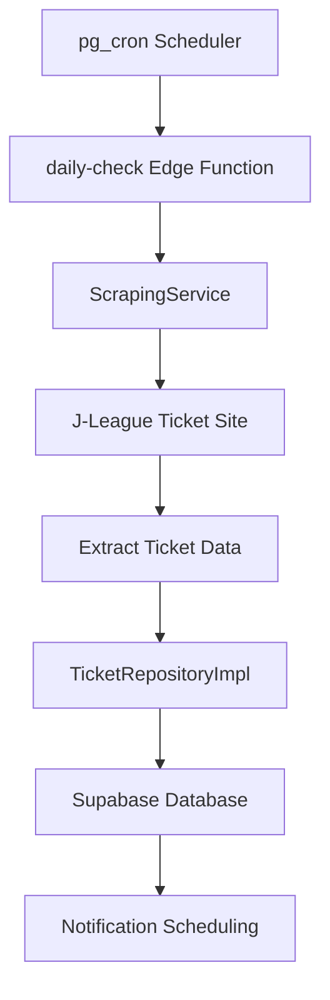
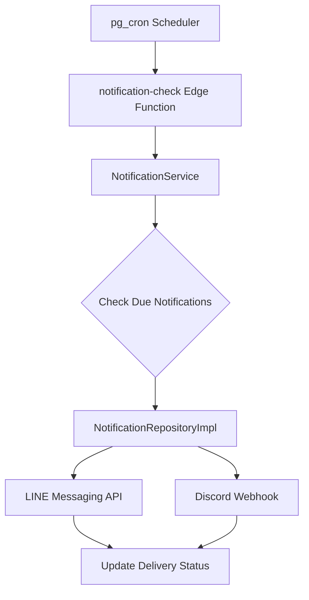

# Architecture Design Document

## System Overview

The urawa-support-hub implements a Clean Architecture pattern with clear separation of concerns,
enabling maintainability, testability, and independence from external frameworks.

## Architecture Layers

### 1. Interface Layer (Edge Functions)

**Responsibility**: Handle external requests and trigger application workflows

```typescript
// Edge Function Entry Points
supabase/functions/
├── daily-check/           # Daily ticket monitoring
├── notification-check/    # Time-based notifications
└── system-health/         # Health monitoring
```

**Key Features**:

- HTTP endpoint handling
- Authentication and authorization
- Request/response transformation
- Error boundary implementation

### 2. Application Layer (Services)

**Responsibility**: Orchestrate business operations and coordinate between layers

```typescript
src/application/services/
├── ScrapingService.ts     # Web scraping orchestration
├── NotificationService.ts # Multi-channel notifications
└── HealthCheckService.ts  # System monitoring
```

**Key Features**:

- Business workflow orchestration
- Cross-cutting concerns (logging, monitoring)
- External service integration
- Transaction management

### 3. Domain Layer (Core Business Logic)

**Responsibility**: Encapsulate business rules and domain knowledge

```typescript
src/domain/
├── entities/              # Business entities with behavior
│   ├── Ticket.ts
│   ├── NotificationHistory.ts
│   ├── NotificationConfig.ts
│   └── __tests__/
└── interfaces/           # Repository contracts
    ├── TicketRepository.ts
    └── NotificationRepository.ts
```

**Key Principles**:

- **Technology Independence**: No external framework dependencies
- **Business Logic Encapsulation**: Rich domain entities with behavior
- **Interface Segregation**: Focused repository contracts
- **Configuration-Driven Design**: Externalized business rules

### 4. Infrastructure Layer (Technical Implementation)

**Responsibility**: Provide technical capabilities and external system integration

```typescript
src/infrastructure/
├── repositories/         # Data persistence implementations
│   ├── TicketRepositoryImpl.ts
│   ├── NotificationRepositoryImpl.ts
│   ├── converters/       # Data transformation
│   └── __tests__/
├── services/            # External service clients
└── utils/               # Technical utilities
    ├── error-handler.ts
    └── constants.ts
```

## Data Flow Architecture

### Ticket Monitoring Flow



### Notification Delivery Flow



## Database Schema

### Tickets Table

```sql
CREATE TABLE tickets (
    id UUID PRIMARY KEY DEFAULT gen_random_uuid(),
    match_name VARCHAR NOT NULL,
    match_date TIMESTAMPTZ NOT NULL,
    venue VARCHAR NOT NULL,
    sale_start_date TIMESTAMPTZ NOT NULL,
    purchase_url VARCHAR NOT NULL,
    seat_categories TEXT[] NOT NULL,
    created_at TIMESTAMPTZ DEFAULT NOW(),
    updated_at TIMESTAMPTZ DEFAULT NOW()
);
```

### Notification History Table

```sql
CREATE TABLE notification_history (
    id UUID PRIMARY KEY DEFAULT gen_random_uuid(),
    ticket_id UUID REFERENCES tickets(id) ON DELETE CASCADE,
    notification_type VARCHAR NOT NULL,
    scheduled_time TIMESTAMPTZ NOT NULL,
    sent_time TIMESTAMPTZ,
    status VARCHAR NOT NULL DEFAULT 'pending',
    retry_count INTEGER DEFAULT 0,
    created_at TIMESTAMPTZ DEFAULT NOW()
);
```

## Configuration Management

### Environment-Based Configuration

```typescript
// Configuration hierarchy
config/
├── development.ts        # Local development settings
├── production.ts         # Production environment
└── base.ts               # Common configuration
```

### Feature Flags

```typescript
export const FEATURE_FLAGS = {
  ENABLE_DISCORD_NOTIFICATIONS: true,
  ENABLE_LINE_NOTIFICATIONS: true,
  ENABLE_RETRY_MECHANISM: true,
  MAX_RETRY_ATTEMPTS: 3,
} as const;
```

## Security Architecture

### Authentication & Authorization

- **Supabase RLS**: Row-level security policies
- **API Key Management**: Secure environment variable storage
- **Rate Limiting**: Edge function request throttling

### Data Protection

- **Input Validation**: Type-safe data processing
- **SQL Injection Prevention**: Parameterized queries
- **Sensitive Data Handling**: No PII storage

## Monitoring & Observability

### Logging Strategy

```typescript
interface LogEntry {
  timestamp: string;
  level: 'INFO' | 'WARN' | 'ERROR' | 'CRITICAL';
  service: string;
  operation: string;
  data?: Record<string, any>;
  error?: Error;
}
```

### Health Checks

```typescript
interface HealthStatus {
  status: 'healthy' | 'degraded' | 'down';
  services: {
    database: ServiceHealth;
    scraping: ServiceHealth;
    notifications: ServiceHealth;
  };
  timestamp: string;
}
```

### Error Tracking

- **Structured Logging**: JSON format for query-ability
- **Error Aggregation**: Pattern recognition
- **Alert Thresholds**: Automatic escalation

## Performance Considerations

### Optimization Strategies

- **Database Indexing**: Query optimization
- **Connection Pooling**: Resource efficiency
- **Caching Strategy**: Reduce external API calls
- **Batch Operations**: Minimize database round-trips

### Constraints Management

- **Memory Limit**: 512MB (Edge Functions)
- **Execution Time**: 60 seconds maximum
- **Rate Limiting**: Respectful scraping intervals
- **Cost Optimization**: Free tier compliance

## Scalability Architecture

### Horizontal Scaling

- **Stateless Functions**: Easy replication
- **Database Partitioning**: Time-based ticket archiving
- **Load Distribution**: Multiple scraping endpoints

### Vertical Scaling

- **Resource Optimization**: Memory and CPU efficiency
- **Query Optimization**: Index usage and query planning
- **Caching Layers**: Redis for frequently accessed data

## Disaster Recovery

### Backup Strategy

- **Database Backups**: Daily automated snapshots
- **Configuration Backup**: Version-controlled settings
- **Code Backup**: Git repository with multiple remotes

### Failover Mechanisms

- **Fallback URLs**: Alternative scraping endpoints
- **Notification Redundancy**: Multiple channel support
- **Health Check Recovery**: Automatic service restart
