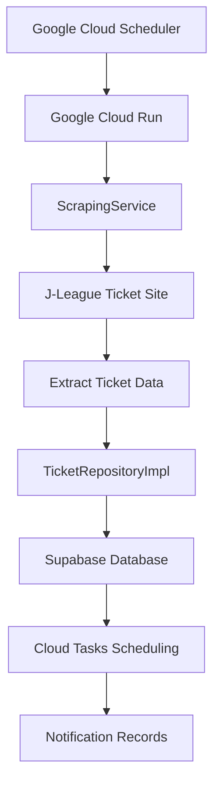
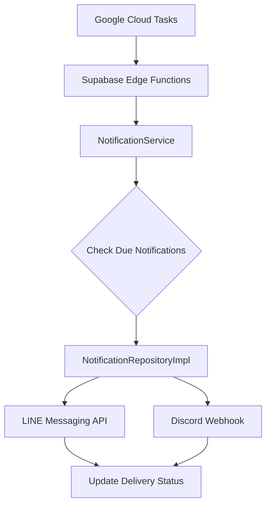

# Architecture Design Documentv2.0

## System Overview

The urawa-support-hub is an automated ticket monitoring and notification system for Urawa Red
Diamonds supporters. The system scrapes ticket information from the J-League website, stores it in a
database, and sends timely notifications to LINE groups before ticket sales begin.

## Architecture Revision History

### v2.0 Changes (2025-01)

- **Added**: Google Cloud Run for web scraping execution environment
- **Added**: Google Cloud Tasks for efficient notification scheduling
- **Removed**: Supabase Edge Functions scraping (technical limitation)
- **Improved**: Notification efficiency (from polling to event-driven)
- **Maintained**: Clean Architecture pattern with clear separation of concerns

## Technology Stack

| Layer                       | Technology              | Purpose                               | Execution Frequency |
| --------------------------- | ----------------------- | ------------------------------------- | ------------------- |
| **Scraping Execution**      | Google Cloud Run        | Playwright execution, data extraction | Once daily          |
| **Schedule Trigger**        | Google Cloud Scheduler  | Trigger daily scraping                | 12:00 JST daily     |
| **Notification Scheduling** | Google Cloud Tasks      | Individual notification timing        | As scheduled        |
| **Data Storage**            | Supabase PostgreSQL     | Ticket and notification history       | Real-time           |
| **Data API**                | Supabase PostgREST      | CRUD operations                       | On-demand           |
| **Notification Delivery**   | Supabase Edge Functions | LINE/Discord messaging                | When triggered      |

## System Architecture

### High-Level Architecture

```
┌─────────────────────────────────────────────────────────┐
│                   Google Cloud Platform                  │
├─────────────────────────────────────────────────────────┤
│  Cloud Scheduler → Cloud Run → Cloud Tasks              │
│       ↓              ↓            ↓                      │
│   (12:00 JST)   (Scraping)   (Schedule)                 │
└─────────────────────────────────────────────────────────┘
                         ↓
┌─────────────────────────────────────────────────────────┐
│                      Supabase                           │
├─────────────────────────────────────────────────────────┤
│  PostgreSQL ← PostgREST API → Edge Functions           │
│      ↓           ↓                ↓                     │
│   (Storage)   (CRUD API)    (Notifications)            │
└─────────────────────────────────────────────────────────┘
                                     ↓
┌─────────────────────────────────────────────────────────┐
│                  External Services                      │
├─────────────────────────────────────────────────────────┤
│            LINE API        Discord Webhook              │
└─────────────────────────────────────────────────────────┘
```

## Clean Architecture Layers

### 1. Interface Layer (Cloud Run + Edge Functions)

**Responsibility**: Handle external requests and trigger application workflows

**Component Structure:**

- Cloud Run Services: Scraping handlers and HTTP endpoints
- Supabase Edge Functions: Notification delivery and health monitoring
- Request processing and response transformation layers

**Key Features**:

- HTTP endpoint handling
- Authentication and authorization
- Request/response transformation
- Error boundary implementation

### 2. Application Layer (Services)

**Responsibility**: Orchestrate business operations and coordinate between layers

**Service Components:**

- ScrapingService: Web scraping orchestration and data extraction
- NotificationService: Multi-channel notification coordination
- HealthCheckService: System monitoring and health validation

**Key Features**:

- Business workflow orchestration
- Cross-cutting concerns (logging, monitoring)
- External service integration
- Transaction management

### 3. Domain Layer (Core Business Logic)

**Responsibility**: Encapsulate business rules and domain knowledge

**Domain Components:**

- Business Entities: Ticket, NotificationHistory, NotificationConfig
- Repository Interfaces: TicketRepository, NotificationRepository
- Domain Services: Business rule validation and processing

**Key Principles**:

- **Technology Independence**: No external framework dependencies
- **Business Logic Encapsulation**: Rich domain entities with behavior
- **Interface Segregation**: Focused repository contracts
- **Configuration-Driven Design**: Externalized business rules

### 4. Infrastructure Layer (Technical Implementation)

**Responsibility**: Provide technical capabilities and external system integration

**Infrastructure Components:**

- Repository Implementations: Data persistence layer
- External Service Clients: Cloud Tasks, Playwright integration
- Technical Utilities: Error handling, logging, configuration management

## Data Flow Architecture

### Ticket Monitoring Flow



### Notification Delivery Flow



## Database Schema

### Tickets Table

```sql
CREATE TABLE tickets (
    id UUID PRIMARY KEY DEFAULT gen_random_uuid(),
    match_name VARCHAR NOT NULL,
    match_date TIMESTAMPTZ NOT NULL,
    venue VARCHAR NOT NULL,
    sale_start_date TIMESTAMPTZ NOT NULL,
    purchase_url VARCHAR NOT NULL,
    seat_categories TEXT[] NOT NULL,
    created_at TIMESTAMPTZ DEFAULT NOW(),
    updated_at TIMESTAMPTZ DEFAULT NOW(),
    UNIQUE(match_name, match_date)
);
```

### Notification History Table

```sql
CREATE TABLE notification_history (
    id UUID PRIMARY KEY DEFAULT gen_random_uuid(),
    ticket_id UUID REFERENCES tickets(id) ON DELETE CASCADE,
    notification_type VARCHAR NOT NULL,
    scheduled_time TIMESTAMPTZ NOT NULL,
    sent_time TIMESTAMPTZ,
    status VARCHAR NOT NULL DEFAULT 'scheduled',
    retry_count INTEGER DEFAULT 0,
    error_message TEXT,
    created_at TIMESTAMPTZ DEFAULT NOW(),
    INDEX idx_status_scheduled (status, scheduled_time)
);
```

### Notification Trigger

```sql
CREATE OR REPLACE FUNCTION create_notification_records()
RETURNS TRIGGER AS $$
BEGIN
  INSERT INTO notification_history 
    (ticket_id, notification_type, scheduled_time, status)
  VALUES
    (NEW.id, 'day_before', NEW.sale_start_date - interval '1 day' + time '20:00', 'scheduled'),
    (NEW.id, 'one_hour', NEW.sale_start_date - interval '1 hour', 'scheduled'),
    (NEW.id, '15_minutes', NEW.sale_start_date - interval '15 minutes', 'scheduled');
  RETURN NEW;
END;
$$ LANGUAGE plpgsql;
```

## Configuration Management

### Environment-Based Configuration

**Configuration Structure:**

- Environment-based configuration files (development, production, base)
- Hierarchical configuration inheritance
- Type-safe configuration validation

### Notification Timing Configuration

**Notification Timing Strategy:**

- **day_before**: 20:00 on the day before sale start (5-minute tolerance)
- **one_hour**: 60 minutes before sale start (2-minute tolerance)
- **fifteen_minutes**: 15 minutes before sale start (1-minute tolerance)

**Configuration Benefits:**

- Centralized timing management
- Easy modification without code changes
- Type-safe configuration validation

```
### Feature Flags

**Feature Management:**
- Toggle-based feature control for all notification channels
- Configurable retry mechanisms with attempt limits
- Environment-specific feature enablement

## Security Architecture

### Authentication & Authorization

#### Service-to-Service Authentication
- **Cloud Run → Supabase**: Service Role Key (environment variable)
- **Cloud Tasks → Edge Functions**: Service Role Key in Authorization header
- **Cloud Scheduler → Cloud Run**: OIDC token with service account

#### Security Best Practices
- All API keys stored in environment variables
- Service Role Keys rotated quarterly
- Minimum privilege principle for service accounts
- No public endpoints without authentication

### Data Protection
- TLS encryption for all API communications
- No PII storage in logs
- Database Row Level Security (RLS) policies
- Input validation at all entry points

## Monitoring & Observability

### Logging Strategy

#### Structured Logging Format
**Structured Logging Format:**
- Standardized log entry structure with severity levels
- Service and operation identification
- Performance metrics and error context
- JSON format for queryability and analysis

### Health Checks

**Health Check Components:**
- System-wide health status aggregation
- Individual service health monitoring
- Database, scraping, notification, and task queue status
- Real-time health reporting with timestamps

### Error Tracking

- **Structured Logging**: JSON format for query-ability
- **Error Aggregation**: Pattern recognition
- **Alert Thresholds**: Automatic escalation via Discord

## Performance Considerations

### Optimization Strategies

#### Cloud Run Optimization
- Container image optimization
- Cold start minimization
- Resource allocation tuning
- Concurrent request handling

#### Database Performance
- **Database Indexing**: Query optimization
- **Connection Pooling**: Resource efficiency
- **Caching Strategy**: Reduce external API calls
- **Batch Operations**: Minimize database round-trips

### Constraints Management

- **Memory Limit**: 2GB (Cloud Run), 512MB (Edge Functions)
- **Execution Time**: 300 seconds (Cloud Run), 60 seconds (Edge Functions)
- **Rate Limiting**: Respectful scraping intervals
- **Cost Optimization**: Free tier compliance

## Scalability Architecture

### Horizontal Scaling

- **Stateless Services**: Easy replication across regions
- **Load Distribution**: Multiple Cloud Run instances
- **Task Distribution**: Cloud Tasks queue management
- **Database Partitioning**: Time-based ticket archiving

### Vertical Scaling

- **Resource Optimization**: Memory and CPU efficiency
- **Query Optimization**: Index usage and query planning
- **Caching Layers**: In-memory caching for frequently accessed data

## Cost Analysis

### Google Cloud (Monthly)
- **Cloud Run**: ~60 minutes/month = Free (180,000 vCPU-seconds free tier)
- **Cloud Scheduler**: 1 job = Free (3 jobs free tier)
- **Cloud Tasks**: ~300 tasks/month = Free (1 million tasks free tier)

### Supabase (Monthly)
- **Database**: < 500MB = Free
- **Edge Functions**: ~300 invocations = Free
- **API Calls**: Minimal = Free

**Total Monthly Cost**: $0 (completely within free tiers)

## Disaster Recovery

### Backup Strategy

- **Database Backups**: Daily automated snapshots (Supabase)
- **Configuration Backup**: Version-controlled settings
- **Code Backup**: Git repository with multiple remotes

### Failover Mechanisms

#### Retry Strategy
- Cloud Tasks: Automatic retry with exponential backoff
- Maximum 3 retry attempts
- Dead letter queue for persistent failures

#### Error Notification
**Error Notification Strategy:**
- Automated error alerting via Discord webhooks
- Context-aware error reporting with service identification
- Stack trace and timestamp inclusion for debugging
- Severity-based alert routing

## Future Enhancement Path

### Phase 1
- ✅ Automated scraping with Cloud Run
- ✅ Event-driven notification scheduling
- ✅ LINE group notifications
- ✅ Clean Architecture implementation

### Phase 2 (Next)
- Manual ticket addition via API
- User preference management
- Individual LINE notifications
- Enhanced monitoring dashboard

### Phase 3 (Future)
- Mobile app with push notifications
- AI-powered ticket recommendations
- Multi-language support
- Seat availability tracking

### Phase 4 (Advanced)
- Ticket purchase automation
- Price tracking and alerts
- Social features for supporter groups
- Integration with official fan club systems
```
