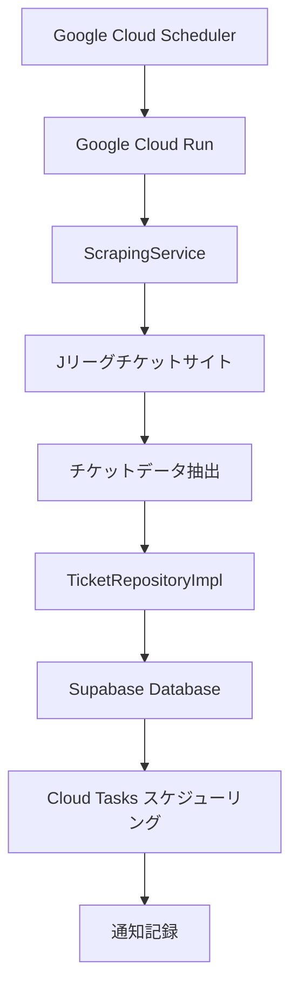
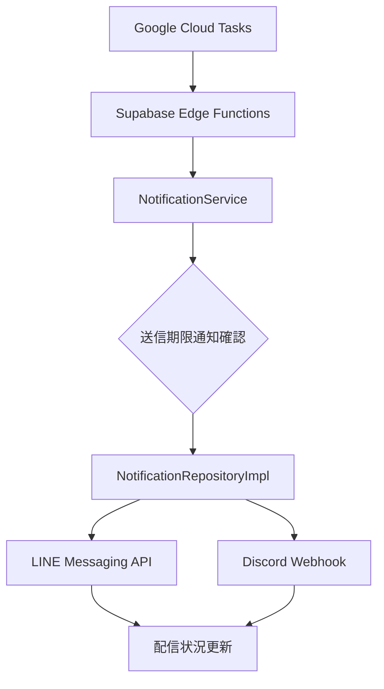

# アーキテクチャ設計書 v2.0

## システム概要

urawa-support-hub
は浦和レッズサポーター向けの自動チケット監視・通知システムです。Jリーグのウェブサイトからチケット情報を取得し、データベースに保存し、チケット販売開始前に適切なタイミングでLINEグループに通知を送信します。

## アーキテクチャ改訂履歴

### v2.0 変更点 (2025-01)

- **追加**: ウェブスクレイピング実行環境としてGoogle Cloud Run
- **追加**: 効率的な通知スケジューリングのためのGoogle Cloud Tasks
- **削除**: Supabase Edge Functionsによるスクレイピング（技術的制限のため）
- **改善**: 通知効率性（ポーリングからイベント駆動へ）
- **維持**: 関心の分離が明確なClean Architectureパターン

## 技術スタック

| レイヤー                 | 技術                    | 目的                       | 実行頻度             |
| ------------------------ | ----------------------- | -------------------------- | -------------------- |
| **スクレイピング実行**   | Google Cloud Run        | Playwright実行、データ抽出 | 日次                 |
| **スケジュール発動**     | Google Cloud Scheduler  | 日次スクレイピング発動     | 毎日12:00 JST        |
| **通知スケジューリング** | Google Cloud Tasks      | 個別通知タイミング         | スケジュールに応じて |
| **データストレージ**     | Supabase PostgreSQL     | チケットと通知履歴         | リアルタイム         |
| **データAPI**            | Supabase PostgREST      | CRUD操作                   | オンデマンド         |
| **通知配信**             | Supabase Edge Functions | LINE/Discordメッセージング | 発動時               |

## システムアーキテクチャ

### 高レベルアーキテクチャ

```
┌─────────────────────────────────────────────────────────┐
│                 Google Cloud Platform                   │
├─────────────────────────────────────────────────────────┤
│  Cloud Scheduler → Cloud Run → Cloud Tasks              │
│       ↓              ↓            ↓                      │
│   (12:00 JST)   (スクレイピング)  (スケジュール)          │
└─────────────────────────────────────────────────────────┘
                         ↓
┌─────────────────────────────────────────────────────────┐
│                      Supabase                          │
├─────────────────────────────────────────────────────────┤
│  PostgreSQL ← PostgREST API → Edge Functions           │
│      ↓           ↓                ↓                     │
│   (ストレージ)  (CRUD API)    (通知)                    │
└─────────────────────────────────────────────────────────┘
                                     ↓
┌─────────────────────────────────────────────────────────┐
│                  外部サービス                           │
├─────────────────────────────────────────────────────────┤
│            LINE API        Discord Webhook              │
└─────────────────────────────────────────────────────────┘
```

## Clean Architectureレイヤー

### 1. インターフェースレイヤー (Cloud Run + Edge Functions)

**責務**: 外部からのリクエスト処理とアプリケーションワークフローの発動

```typescript
// Cloud Run サービスエントリーポイント
src/interfaces/
├── scraping/              # Cloud Runスクレイピングハンドラー
├── edge-functions/        # Supabase Edge Functions
│   ├── notification/      # 通知配信
│   └── health-check/      # システム監視
```

**主要機能**:

- HTTPエンドポイント処理
- 認証・認可
- リクエスト・レスポンス変換
- エラー境界実装

### 2. アプリケーションレイヤー (サービス)

**責務**: ビジネス処理のオーケストレーションとレイヤー間の調整

```typescript
src/application/services/
├── ScrapingService.ts     # ウェブスクレイピングのオーケストレーション
├── NotificationService.ts # マルチチャンネル通知
└── HealthCheckService.ts  # システム監視
```

**主要機能**:

- ビジネスワークフローのオーケストレーション
- 横断的関心事（ログ、監視）
- 外部サービス統合
- トランザクション管理

### 3. ドメインレイヤー (コアビジネスロジック)

**責務**: ビジネスルールとドメイン知識のカプセル化

```typescript
src/domain/
├── entities/              # 振る舞いを持つビジネスエンティティ
│   ├── Ticket.ts
│   ├── NotificationHistory.ts
│   ├── NotificationConfig.ts
│   └── __tests__/
└── interfaces/           # リポジトリ契約
    ├── TicketRepository.ts
    └── NotificationRepository.ts
```

**主要原則**:

- **技術独立性**: 外部フレームワーク依存なし
- **ビジネスロジックのカプセル化**: 豊富な振る舞いを持つドメインエンティティ
- **インターフェース分離**: 焦点を絞ったリポジトリ契約
- **設定駆動設計**: 外部化されたビジネスルール

### 4. インフラストラクチャレイヤー (技術実装)

**責務**: 技術機能と外部システム統合の提供

```typescript
src/infrastructure/
├── repositories/         # データ永続化実装
│   ├── TicketRepositoryImpl.ts
│   ├── NotificationRepositoryImpl.ts
│   ├── converters/       # データ変換
│   └── __tests__/
├── services/            # 外部サービスクライアント
│   ├── CloudTasksClient.ts
│   └── PlaywrightClient.ts
└── utils/               # 技術ユーティリティ
    ├── error-handler.ts
    └── constants.ts
```

## データフローアーキテクチャ

### チケット監視フロー



### 通知配信フロー



## データベーススキーマ

### チケットテーブル

```sql
CREATE TABLE tickets (
    id UUID PRIMARY KEY DEFAULT gen_random_uuid(),
    match_name VARCHAR NOT NULL,
    match_date TIMESTAMPTZ NOT NULL,
    venue VARCHAR NOT NULL,
    sale_start_date TIMESTAMPTZ NOT NULL,
    purchase_url VARCHAR NOT NULL,
    seat_categories TEXT[] NOT NULL,
    created_at TIMESTAMPTZ DEFAULT NOW(),
    updated_at TIMESTAMPTZ DEFAULT NOW(),
    UNIQUE(match_name, match_date)
);
```

### 通知履歴テーブル

```sql
CREATE TABLE notification_history (
    id UUID PRIMARY KEY DEFAULT gen_random_uuid(),
    ticket_id UUID REFERENCES tickets(id) ON DELETE CASCADE,
    notification_type VARCHAR NOT NULL,
    scheduled_time TIMESTAMPTZ NOT NULL,
    sent_time TIMESTAMPTZ,
    status VARCHAR NOT NULL DEFAULT 'scheduled',
    retry_count INTEGER DEFAULT 0,
    error_message TEXT,
    created_at TIMESTAMPTZ DEFAULT NOW(),
    INDEX idx_status_scheduled (status, scheduled_time)
);
```

### 通知トリガー

```sql
CREATE OR REPLACE FUNCTION create_notification_records()
RETURNS TRIGGER AS $$
BEGIN
  INSERT INTO notification_history 
    (ticket_id, notification_type, scheduled_time, status)
  VALUES
    (NEW.id, 'day_before', NEW.sale_start_date - interval '1 day' + time '20:00', 'scheduled'),
    (NEW.id, 'one_hour', NEW.sale_start_date - interval '1 hour', 'scheduled'),
    (NEW.id, '15_minutes', NEW.sale_start_date - interval '15 minutes', 'scheduled');
  RETURN NEW;
END;
$$ LANGUAGE plpgsql;
```

## 設定管理

### 環境ベース設定

```typescript
// 設定階層
config/
├── development.ts        # ローカル開発設定
├── production.ts         # 本番環境
└── base.ts               # 共通設定
```

### 通知タイミング設定

```typescript
export const NOTIFICATION_TIMING_CONFIG = {
  day_before: {
    displayName: '販売開始前日',
    calculateScheduledTime: (saleStartDate: Date): Date => {
      // 前日20:00に設定
      const scheduledTime = new Date(saleStartDate);
      scheduledTime.setDate(scheduledTime.getDate() - 1);
      scheduledTime.setHours(20, 0, 0, 0);
      return scheduledTime;
    },
    toleranceMs: 5 * 60 * 1000,
  },
  one_hour: {
    displayName: '販売開始1時間前',
    calculateScheduledTime: (saleStartDate: Date): Date => {
      return new Date(saleStartDate.getTime() - 60 * 60 * 1000);
    },
    toleranceMs: 2 * 60 * 1000,
  },
  fifteen_minutes: {
    displayName: '販売開始15分前',
    calculateScheduledTime: (saleStartDate: Date): Date => {
      return new Date(saleStartDate.getTime() - 15 * 60 * 1000);
    },
    toleranceMs: 1 * 60 * 1000,
  },
};
```

### 機能フラグ

```typescript
export const FEATURE_FLAGS = {
  ENABLE_DISCORD_NOTIFICATIONS: true,
  ENABLE_LINE_NOTIFICATIONS: true,
  ENABLE_RETRY_MECHANISM: true,
  MAX_RETRY_ATTEMPTS: 3,
  ENABLE_CLOUD_TASKS: true,
} as const;
```

## セキュリティアーキテクチャ

### 認証・認可

#### サービス間認証

- **Cloud Run → Supabase**: サービスロールキー（環境変数）
- **Cloud Tasks → Edge Functions**: 認証ヘッダーのサービスロールキー
- **Cloud Scheduler → Cloud Run**: サービスアカウントによるOIDCトークン

#### セキュリティベストプラクティス

- 全APIキーを環境変数に格納
- サービスロールキーの四半期ローテーション
- サービスアカウントの最小権限の原則
- 認証なしのパブリックエンドポイントなし

### データ保護

- 全API通信のTLS暗号化
- ログにPII情報なし
- データベース行レベルセキュリティ（RLS）ポリシー
- 全エントリーポイントでの入力検証

## 監視・可観測性

### ログ戦略

#### 構造化ログフォーマット

```typescript
interface LogEntry {
  timestamp: string;
  severity: 'INFO' | 'WARN' | 'ERROR' | 'CRITICAL';
  service: string;
  operation: string;
  duration_ms?: number;
  data?: Record<string, any>;
  error?: Error;
}
```

### ヘルスチェック

```typescript
interface HealthStatus {
  status: 'healthy' | 'degraded' | 'down';
  services: {
    database: ServiceHealth;
    scraping: ServiceHealth;
    notifications: ServiceHealth;
    cloudTasks: ServiceHealth;
  };
  timestamp: string;
}
```

### エラー追跡

- **構造化ログ**: クエリ可能なJSON形式
- **エラー集約**: パターン認識
- **アラート閾値**: Discordによる自動エスカレーション

## パフォーマンス考慮事項

### 最適化戦略

#### Cloud Run最適化

- コンテナイメージ最適化
- コールドスタート最小化
- リソース割り当て調整
- 同時リクエスト処理

#### データベースパフォーマンス

- **データベースインデックス**: クエリ最適化
- **接続プーリング**: リソース効率性
- **キャッシュ戦略**: 外部APIコール削減
- **バッチ操作**: データベースラウンドトリップ最小化

### 制約管理

- **メモリ制限**: 2GB（Cloud Run）、512MB（Edge Functions）
- **実行時間**: 300秒（Cloud Run）、60秒（Edge Functions）
- **レート制限**: 配慮したスクレイピング間隔
- **コスト最適化**: 無料枠準拠

## スケーラビリティアーキテクチャ

### 水平スケーリング

- **ステートレスサービス**: リージョン間での簡単な複製
- **負荷分散**: 複数のCloud Runインスタンス
- **タスク分散**: Cloud Tasksキュー管理
- **データベース分割**: 時系列ベースのチケットアーカイブ

### 垂直スケーリング

- **リソース最適化**: メモリとCPU効率性
- **クエリ最適化**: インデックス使用とクエリ計画
- **キャッシュレイヤー**: 頻繁にアクセスされるデータのインメモリキャッシュ

## コスト分析

### Google Cloud（月額）

- **Cloud Run**: ~60分実行 = 無料（180,000 vCPU秒無料枠）
- **Cloud Scheduler**: 1ジョブ = 無料（3ジョブ無料枠）
- **Cloud Tasks**: ~300タスク = 無料（100万タスク無料枠）

### Supabase（月額）

- **データベース**: <500MB = 無料
- **Edge Functions**: ~300呼び出し = 無料
- **APIコール**: 最小限 = 無料

**月間総コスト**: 0円（完全に無料枠内）

## 災害復旧

### バックアップ戦略

- **データベースバックアップ**: 日次自動スナップショット（Supabase）
- **設定バックアップ**: バージョン管理された設定
- **コードバックアップ**: 複数リモートを持つGitリポジトリ

### フェイルオーバーメカニズム

#### リトライ戦略

- Cloud Tasks: 指数バックオフでの自動リトライ
- 最大3回のリトライ試行
- 持続的障害のためのデッドレターキュー

#### エラー通知

```typescript
async function notifyError(error: Error, context: any) {
  await sendDiscordAlert({
    level: 'ERROR',
    service: context.service,
    message: error.message,
    stack: error.stack,
    timestamp: new Date().toISOString(),
  });
}
```

## 将来の拡張パス

### フェーズ1（現在）

- ✅ Cloud Runでの自動スクレイピング
- ✅ イベント駆動通知スケジューリング
- ✅ LINEグループ通知
- ✅ Clean Architecture実装

### フェーズ2（次回）

- API経由の手動チケット追加
- ユーザー設定管理
- 個別LINE通知
- 強化された監視ダッシュボード

### フェーズ3（将来）

- プッシュ通知付きモバイルアプリ
- AI駆動のチケット推薦
- 多言語対応
- 座席空き状況追跡

### フェーズ4（高度）

- チケット購入自動化
- 価格追跡・アラート
- サポーターグループ向けソーシャル機能
- 公式ファンクラブシステム統合
