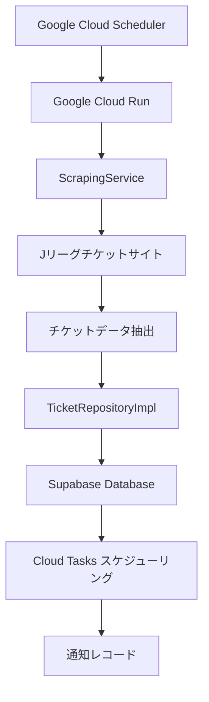
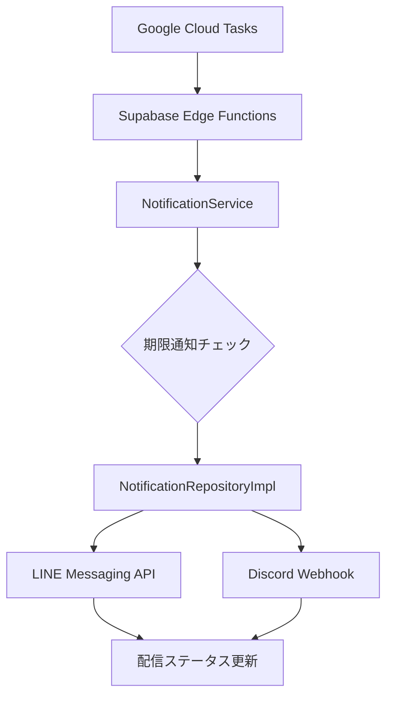

# システムアーキテクチャ文書

## システム概要

urawa-support-hubは、浦和レッズサポーター向けの自動チケット監視・通知システムです。Jリーグウェブサイトからチケット情報をスクレイピングし、データベースに保存し、チケット販売開始前にLINE
Botのフォロワー全員へブロードキャスト配信によりタイムリーな通知を送信します。

## 技術スタック

| レイヤー                 | 技術                   | 目的                         | 実行頻度         |
| ------------------------ | ---------------------- | ---------------------------- | ---------------- |
| **アプリケーション実行** | Google Cloud Run       | すべてのビジネスロジック実行 | オンデマンド     |
| **スケジュールトリガー** | Google Cloud Scheduler | 日次スクレイピングトリガー   | 毎日12:00 JST    |
| **タスクキュー**         | Google Cloud Tasks     | 非同期タスクスケジューリング | スケジュール通り |
| **データストレージ**     | Supabase PostgreSQL    | プライマリデータ永続化       | リアルタイム     |
| **データAPI**            | Supabase PostgREST     | 自動生成REST API             | オンデマンド     |

## 簡素化アーキテクチャ（GCP + Supabaseデータベース）

### ハイレベルアーキテクチャ

```
┌─────────────────────────────────────────────────────────┐
│                Google Cloud Platform                    │
├─────────────────────────────────────────────────────────┤
│  Cloud Scheduler → Cloud Run → Cloud Tasks             │
│       ↓              ↓            ↓                     │
│   (12:00 JST)   (すべてのロジック) (非同期タスク)       │
│                      ↓                                  │
│                 APIエンドポイント:                       │
│                 • /api/collect-tickets                  │
│                 • /api/send-notification                │
└─────────────────────────────────────────────────────────┘
                         ↓
┌─────────────────────────────────────────────────────────┐
│                      Supabase                          │
├─────────────────────────────────────────────────────────┤
│         PostgreSQL ← PostgREST API                     │
│            ↓             ↓                              │
│      (データストレージ)  (CRUD API)                      │
└─────────────────────────────────────────────────────────┘
                                     ↓
┌─────────────────────────────────────────────────────────┐
│                  外部サービス                            │
├─────────────────────────────────────────────────────────┤
│            LINE API        Discord Webhook              │
└─────────────────────────────────────────────────────────┘
```

## クリーンアーキテクチャ実装

### レイヤー構造

```
┌─────────────────────────────────────┐
│     Interface Layer                │  ← Cloud Run Service, Edge Functions
├─────────────────────────────────────┤
│     Application Layer              │  ← UseCases: TicketCollectionUseCase
├─────────────────────────────────────┤
│        Domain Layer               │  ← Entities: Ticket, NotificationHistory
├─────────────────────────────────────┤
│     Infrastructure Layer          │  ← Services: ScrapingService, UrawaScrapingService
│                                   │    Repositories: TicketRepositoryImpl
│                                   │    Config: notification.ts, scraping.ts
└─────────────────────────────────────┘
```

### レイヤー責務

#### 1. Interface Layer（Cloud Run + Edge Functions）

**責務**: 外部リクエストの処理とアプリケーションワークフローのトリガー

#### 2. Application Layer（Use Cases）

**責務**: ビジネス操作のオーケストレーションとレイヤー間の調整

**UseCase コンポーネント:**

- **TicketCollectionUseCase**: 日次チケットスクレイピングワークフローのオーケストレーション
  - スクレイピングサービス実行の調整
  - システムヘルスメトリクスの記録
  - エラーシナリオとリカバリーの処理

**主要機能:**

- ビジネスワークフローのオーケストレーション
- 横断的関心事（ログ、ヘルス監視）
- ビジネスロジックとインフラストラクチャの明確な分離
- テスタビリティのための依存性注入

#### 3. Domain Layer（コアビジネスロジック）

**責務**: ビジネスルールとドメイン知識のカプセル化

**ドメインコンポーネント:**

- **ビジネスエンティティ**: Ticket, NotificationHistory, SystemHealth
- **ビジネスロジック**: 通知タイミング計算、チケット検証
- **ドメインサービス**: 設定駆動通知ルール

#### 4. Infrastructure Layer（技術実装）

**責務**: 技術的機能と外部システム統合の提供

**インフラストラクチャコンポーネント:**

- **リポジトリ実装**: TicketRepositoryImpl, NotificationRepositoryImpl, HealthRepositoryImpl
- **スクレイピングサービス**: ScrapingService（基底クラス）, UrawaScrapingService（浦和固有）
- **外部サービスクライアント**: Supabaseクライアント、Playwright統合
- **設定管理**: notification.ts, scraping.ts, url.ts
- **技術ユーティリティ**: エラーハンドリング、ログ、型定義
- **ファクトリーパターン**: 依存性管理のためのRepositoryFactory

```
┌─────────────────────────────────────┐
│     インターフェースレイヤー         │  ← Cloud Run Service, Edge Functions
├─────────────────────────────────────┤
│     アプリケーションサービス         │  ← ScrapingService, NotificationService  
├─────────────────────────────────────┤
│        ドメインレイヤー             │  ← エンティティ: Ticket, NotificationHistory
├─────────────────────────────────────┤
│     インフラストラクチャレイヤー     │  ← RepositoryImpl, CloudTasks, Supabase
└─────────────────────────────────────┘
```

### レイヤー責務

#### 1. インターフェースレイヤー（Cloud Run + Edge Functions）

**責務**: 外部リクエストの処理とアプリケーションワークフローのトリガー

**コンポーネント:**

- **Cloud Run Service**: ウェブスクレイピング実行環境
  - `scrape`: 日次チケット抽出エンドポイント
  - `health`: サービスヘルス監視エンドポイント
- **Supabase Edge Functions**: 通知配信とヘルス監視
  - `send-notification`: 個別通知リクエスト処理
  - `system-health`: システム状態・パフォーマンス監視

**主要機能:**

- HTTPエンドポイント処理
- 認証・認可
- リクエスト/レスポンス変換
- エラー境界実装

#### 2. アプリケーションレイヤー（サービス）

**責務**: ビジネス操作のオーケストレーションとレイヤー間調整

**サービスコンポーネント:**

- **ScrapingService**: ウェブスクレイピングオーケストレーションとデータ抽出
- **NotificationService**: マルチチャンネル通知調整
- **CloudTasksService**: イベント駆動通知スケジューリング

**主要機能:**

- ビジネスワークフローオーケストレーション
- 横断的関心事（ログ、監視）
- 外部サービス統合
- トランザクション管理

#### 3. ドメインレイヤー（コアビジネスロジック）

**責務**: ビジネスルールとドメイン知識のカプセル化

**ドメインコンポーネント:**

- **ビジネスエンティティ**: Ticket, NotificationHistory, NotificationConfig
- **ドメインサービス**: ビジネスルール検証と処理

**主要原則:**

- **技術独立性**: 外部フレームワーク依存なし
- **ビジネスロジックカプセル化**: 振る舞いを持つリッチドメインエンティティ
- **インターフェース分離**: 焦点を絞ったリポジトリ契約
- **設定駆動設計**: 外部化されたビジネスルール

#### 4. インフラストラクチャレイヤー（技術実装）

**責務**: 技術的能力と外部システム統合の提供

**インフラストラクチャコンポーネント:**

- **リポジトリ実装**: データ永続化レイヤー
- **外部サービスクライアント**: Cloud Tasks, Playwright統合
- **技術ユーティリティ**: エラーハンドリング、ログ、設定管理

## システムコンポーネント

### Google Cloud Platformコンポーネント

#### Cloud Run Service

- **目的**: 十分なリソースでウェブスクレイピング実行
- **設定**:
  - メモリ: 2GB
  - CPU: 1 vCPU
  - タイムアウト: 300秒
  - 同時実行: 1（順次処理）

#### Cloud Scheduler

- **目的**: 信頼性の高い日次トリガーメカニズム
- **設定**:
  - スケジュール: 0 3 * * * (03:00 UTC = 12:00 JST)
  - ターゲット: Cloud Run service
  - 認証: OIDCトークン

#### Cloud Tasks

- **目的**: イベント駆動通知スケジューリング
- **設定**:
  - キュー: notifications
  - ロケーション: asia-northeast1
  - リトライポリシー: 指数バックオフで3回試行
  - レート制限: 10 dispatches/秒

### Supabaseコンポーネント

#### PostgreSQL Database

- **目的**: ACID準拠のプライマリデータストレージ
- **機能**:
  - 行レベルセキュリティ（RLS）
  - 通知スケジューリング用自動トリガー
  - リアルタイム購読機能

#### PostgREST API

- **目的**: データベーススキーマから自動生成されたREST API
- **機能**:
  - 型安全なデータベース操作
  - 自動API文書化
  - 内蔵フィルタリング・ページネーション

#### Edge Functions

- **目的**: サーバーレス通知配信
- **Functions**:
  - `send-notification`: 個別通知リクエスト処理
  - `system-health`: システム状態・パフォーマンス監視

## データフローアーキテクチャ

### チケット監視フロー



### 通知配信フロー



## 設計パターン

### リポジトリパターン（拡張版）

- 具体的な実装クラスを直接使用し、小規模プロジェクトに適したシンプルな設計
- テスト時はMockを使用して具象クラスをモック化
- ドメインロジックを永続化の関心事から分離
- **拡張**: スケジューリング用Cloud Tasks統合

```typescript
export class TicketRepositoryImpl {
  save(ticket: Ticket): Promise<void>;
  findByMatchDate(date: Date): Promise<Ticket[]>;
  // イベント駆動通知スケジューリング
  scheduleNotifications(ticketId: string): Promise<void>;
}
```

### 設定駆動設計

- 外部化された通知タイミング設定
- コード変更なしでランタイム調整可能
- 型安全な設定管理
- 複雑なタイミング計算をサポート

```typescript
export const NOTIFICATION_TIMING_CONFIG = {
  day_before: {
    displayName: 'Day before sale start',
    calculateScheduledTime: (saleStartDate: Date): Date => {
      const scheduledTime = new Date(saleStartDate);
      scheduledTime.setDate(scheduledTime.getDate() - 1);
      scheduledTime.setHours(20, 0, 0, 0);
      return scheduledTime;
    },
    toleranceMs: 5 * 60 * 1000,
  },
};
```

### イベント駆動アーキテクチャ

- **疎結合コンポーネント**: サービス間はイベント経由で通信
- **非同期処理**: ノンブロッキング通知スケジューリング
- **スケーラブル設計**: コンポーネントの独立スケーリング
- **エラー分離**: 一つのコンポーネントの障害が他に波及しない

### サービスオーケストレーションパターン

```typescript
// Cloud Run が複数サービスをオーケストレート
export class ScrapingOrchestrator {
  constructor(
    private scrapingService: ScrapingService,
    private ticketRepository: TicketRepositoryImpl,
    private cloudTasksService: CloudTasksService,
  ) {}

  async executeDaily(): Promise<void> {
    const tickets = await this.scrapingService.scrapeTickets();

    for (const ticket of tickets) {
      await this.ticketRepository.save(ticket);
      await this.cloudTasksService.scheduleNotifications(ticket);
    }
  }
}
```

## エラーハンドリング戦略

### レイヤードエラーハンドリング

- **ドメインレイヤー**: ビジネスルール違反
- **アプリケーションレイヤー**: サービスオーケストレーションエラー
- **インフラストラクチャレイヤー**: 外部サービス障害
- **インターフェースレイヤー**: HTTP/リクエストエラー

### リトライメカニズム

- **Cloud Tasks**: 内蔵指数バックオフ
- **データベース操作**: コネクションプールリトライ
- **外部API**: サーキットブレーカー付きカスタムリトライ

### エラー復旧

```typescript
export class ErrorRecoveryService {
  async handleScrapingFailure(error: Error): Promise<void> {
    // 構造化エラーログ
    await this.logger.error('Scraping failed', { error, timestamp: new Date() });

    // Discord アラート送信
    await this.alertService.sendErrorAlert(error);

    // 適切な場合はリトライスケジュール
    if (this.shouldRetry(error)) {
      await this.scheduleRetry();
    }
  }
}
```

## セキュリティアーキテクチャ

### サービス間認証

```typescript
const AUTH_FLOW = {
  'Cloud Scheduler → Cloud Run': 'OIDCトークン (サービスアカウント)',
  'Cloud Run → Supabase': 'サービスロールキー (JWT)',
  'Cloud Tasks → Edge Functions': 'サービスロールキー (Authorization Header)',
  'Edge Functions → External APIs': 'APIキー (環境変数)',
};
```

### データ保護

- **転送中暗号化**: 全API通信でTLS 1.3
- **保存時暗号化**: Supabase自動データベース暗号化
- **シークレット管理**: 適切なアクセス制御付き環境変数
- **入力検証**: 全境界で型安全処理

### アクセス制御

- **最小権限の原則**: 必要最小限の権限
- **IAMポリシー**: 細かなGoogle Cloud IAMロール
- **ネットワークセキュリティ**: 可能な限りプライベートサービス通信

## パフォーマンス特性

### システムパフォーマンス目標

| メトリック               | パフォーマンス目標 | 実装                       |
| ------------------------ | ------------------ | -------------------------- |
| **スクレイピング成功率** | ~98%               | Cloud Run信頼性            |
| **通知レイテンシ**       | <30秒              | イベント駆動アーキテクチャ |
| **同時処理**             | 無制限スケーリング | Cloud Run自動スケーリング  |
| **エラー復旧**           | 100%自動化         | Cloud Tasksリトライ        |

### リソース最適化

#### Cloud Run最適化

- **メモリ**: Playwrightブラウザプロセス用2GB割り当て
- **CPU**: 十分な処理能力のため1 vCPU
- **コールドスタート**: 最適化されたコンテナイメージで最小化
- **スケーリング**: リクエスト量に基づく自動スケーリング

#### データベース最適化

- **コネクションプーリング**: Supabase内蔵プーリング
- **クエリ最適化**: 高速検索用インデックス化カラム
- **バッチ操作**: 複数通知の一括スケジューリング

## コスト分析

### Google Cloud（月次）

- **Cloud Run**: ~60分/月 = 無料（180,000 vCPU秒無料枠）
- **Cloud Scheduler**: 1ジョブ = 無料（3ジョブ無料枠）
- **Cloud Tasks**: ~300タスク/月 = 無料（100万タスク無料枠）

### Supabase（月次）

- **データベース**: < 500MB = 無料
- **Edge Functions**: ~300呼び出し = 無料
- **APIコール**: 最小限 = 無料

**月次総コスト**: $0（完全に無料枠内）

## 監視・可観測性

### 分散トレーシング

```typescript
interface TraceContext {
  traceId: string;
  spanId: string;
  parentSpanId?: string;
  operation: string;
  startTime: Date;
  endTime?: Date;
  tags: Record<string, any>;
}
```

### 構造化ログ

```typescript
interface LogEntry {
  timestamp: string;
  severity: 'INFO' | 'WARN' | 'ERROR' | 'CRITICAL';
  service: 'cloud-run' | 'edge-functions' | 'cloud-tasks';
  operation: string;
  traceId?: string;
  duration_ms?: number;
  data?: Record<string, any>;
  error?: Error;
}
```

### ヘルス監視

#### サービスヘルスチェック

- **Cloud Run**: 依存関係チェック付き`/health`エンドポイント
- **Edge Functions**: 内蔵ヘルス監視
- **データベース**: 接続・クエリパフォーマンス監視
- **外部サービス**: API可用性・応答時間追跡

#### アラート閾値

```typescript
const ALERT_THRESHOLDS = {
  SCRAPING_FAILURE_RATE: 0.1, // 10%失敗率
  NOTIFICATION_DELAY_MINUTES: 5, // 5分遅延
  ERROR_COUNT_PER_HOUR: 10, // 1時間10エラー
  RESPONSE_TIME_MS: 30000, // 30秒応答時間
};
```

## スケーラビリティ・信頼性

### 水平スケーリング

- **ステートレスサービス**: 複数リージョンでの簡単レプリケーション
- **負荷分散**: 複数Cloud Runインスタンス
- **タスク分散**: Cloud Tasksキュー管理
- **データベースパーティショニング**: 時間ベースチケットアーカイブ

### 災害復旧

#### バックアップ戦略

- **データベースバックアップ**: 日次自動スナップショット（Supabase）
- **設定バックアップ**: バージョン管理された設定
- **コードバックアップ**: 複数リモートのGitリポジトリ

#### フェイルオーバーメカニズム

- **Cloud Tasks**: 指数バックオフでの自動リトライ
- **最大3回のリトライ試行**
- **持続的障害用デッドレターキュー**
- **Discord webhook経由の自動エラーアラート**

## 現在のディレクトリ構造（クリーンアーキテクチャ）

### プロジェクトレイアウト

```
src/
├── application/
│   └── usecases/                     # アプリケーション Use Cases
│       ├── TicketCollectionUseCase.ts
│       └── __tests__/
├── domain/
│   └── entities/                     # ドメインエンティティ
│       ├── Ticket.ts
│       ├── NotificationHistory.ts
│       ├── NotificationTypes.ts
│       ├── SystemHealth.ts
│       ├── ErrorLog.ts
│       ├── index.ts
│       └── __tests__/
└── infrastructure/
    ├── config/                      # 設定管理
    │   ├── notification.ts
    │   ├── scraping.ts
    │   ├── url.ts
    │   ├── supabase.ts
    │   ├── types/
    │   │   ├── ScrapingConfig.ts
    │   │   └── UrlConfig.ts
    │   └── __tests__/
    ├── repositories/                # リポジトリ実装
    │   ├── TicketRepositoryImpl.ts
    │   ├── NotificationRepositoryImpl.ts
    │   ├── HealthRepositoryImpl.ts
    │   ├── RepositoryFactory.ts
    │   ├── converters/
    │   │   ├── TicketConverter.ts
    │   │   ├── NotificationConverter.ts
    │   │   └── HealthConverter.ts
    │   └── __tests__/
    ├── services/
    │   └── scraping/                # スクレイピングサービス
    │       ├── ScrapingService.ts
    │       ├── UrawaScrapingService.ts
    │       └── __tests__/
    ├── types/
    │   └── database.ts              # データベース型定義
    └── utils/
        ├── constants.ts
        └── error-handler.ts
```

### 主要なアーキテクチャ変更

1. **Application層の導入**:
   ビジネスワークフローオーケストレーション用の新しい`application/usecases/`レイヤー
2. **Infrastructure再編成**:
   - 設定を`src/config/`から`src/infrastructure/config/`に移動
   - サービスを`src/infrastructure/services/`下に整理
3. **Domain層の簡素化**:
   Repositoryインターフェースを削除し、小規模プロジェクトに適したシンプルな設計に変更
4. **ファクトリーパターン**: 具象クラス管理のための`RepositoryFactory`（インターフェースなし）
