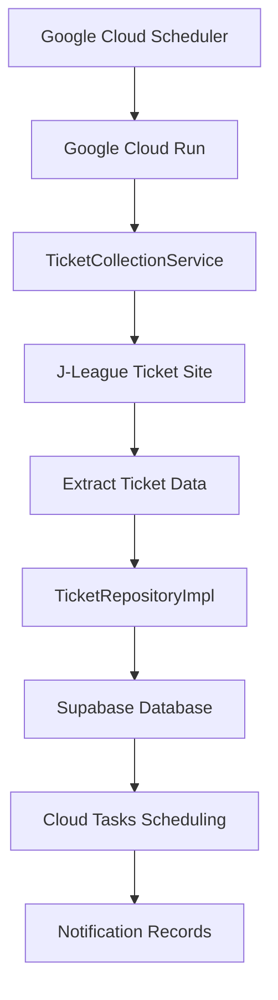
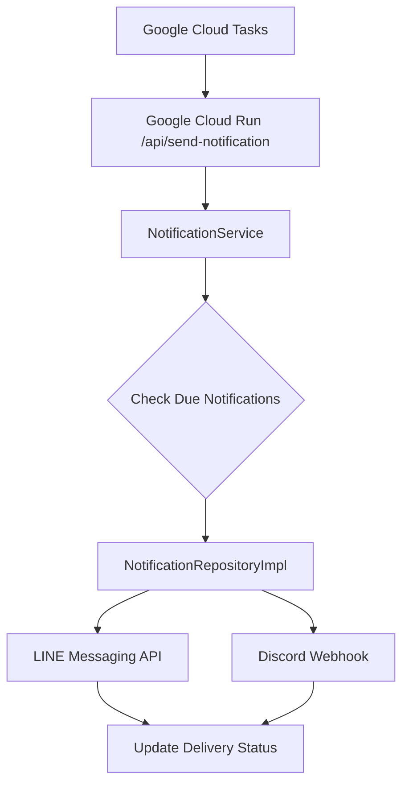

# System Architecture Document

## System Overview

The urawa-support-hub is an automated ticket monitoring and notification system for Urawa Red
Diamonds supporters. The system scrapes ticket information from the J-League website, stores it in a
database, and sends timely notifications to all LINE Bot followers via broadcast messaging before
ticket sales begin.

## Technology Stack

| Layer                   | Technology             | Purpose                      | Execution Frequency |
| ----------------------- | ---------------------- | ---------------------------- | ------------------- |
| **Application Runtime** | Google Cloud Run       | All business logic execution | On-demand           |
| **Schedule Trigger**    | Google Cloud Scheduler | Trigger daily scraping       | 12:00 JST daily     |
| **Task Queue**          | Google Cloud Tasks     | Asynchronous task scheduling | As scheduled        |
| **Data Storage**        | Supabase PostgreSQL    | Primary data persistence     | Real-time           |
| **Data API**            | Supabase PostgREST     | Auto-generated REST API      | On-demand           |

## Simplified Architecture (GCP + Supabase Database)

### High-Level Architecture

```
┌─────────────────────────────────────────────────────────┐
│                Google Cloud Platform                    │
├─────────────────────────────────────────────────────────┤
│  Cloud Scheduler → Cloud Run → Cloud Tasks             │
│       ↓              ↓            ↓                     │
│   (12:00 JST)   (All Logic)   (Async Tasks)            │
│                      ↓                                  │
│                 API Endpoints:                          │
│                 • /api/collect-tickets                  │
│                 • /api/send-notification                │
└─────────────────────────────────────────────────────────┘
                         ↓
┌─────────────────────────────────────────────────────────┐
│                      Supabase                          │
├─────────────────────────────────────────────────────────┤
│         PostgreSQL ← PostgREST API                     │
│            ↓             ↓                              │
│      (Data Storage)  (CRUD API)                        │
└─────────────────────────────────────────────────────────┘
                         ↓
┌─────────────────────────────────────────────────────────┐
│                  External Services                      │
├─────────────────────────────────────────────────────────┤
│            LINE API        Discord Webhook              │
└─────────────────────────────────────────────────────────┘
```

## Clean Architecture Implementation

### Layer Structure

```
┌─────────────────────────────────────┐
│     Interface Layer                │  ← Cloud Run Service, Edge Functions
├─────────────────────────────────────┤
│     Application Layer              │  ← UseCases: TicketCollectionUseCase
├─────────────────────────────────────┤
│        Domain Layer               │  ← Entities: Ticket, NotificationHistory
│                                   │    Interfaces: TicketRepository, HealthRepository
├─────────────────────────────────────┤
│     Infrastructure Layer          │  ← Services: TicketCollectionService, JLeagueTicketScraper
│                                   │    Repositories: TicketRepositoryImpl
│                                   │    Config: notification.ts, url.ts
└─────────────────────────────────────┘
```

### Layer Responsibilities

#### 1. Interface Layer (Cloud Run)

**Responsibility**: Handle all external requests and trigger application workflows

**Components:**

- **Cloud Run Service**: Unified execution environment for all business logic
  - `/api/collect-tickets`: Daily ticket extraction endpoint (triggered by Cloud Scheduler)
    - **Flow**: TicketCollectionController → TicketCollectionUseCase → TicketCollectionService
  - `/api/send-notification`: LINE and Discord notification delivery (triggered by Cloud Tasks)
    - **Flow**: NotificationController → NotificationUseCase → NotificationService
  - `/api/process-pending-notifications`: Manual pending notification processing (triggered by Cloud
    Scheduler)
    - **Flow**: NotificationController → NotificationUseCase → NotificationService

**Key Features:**

- HTTP endpoint handling
- Authentication and authorization via OIDC tokens
- Request/response transformation
- Error boundary implementation
- Unified logging and monitoring

#### 2. Application Layer (Use Cases)

**Responsibility**: Orchestrate business operations and coordinate between layers

**UseCase Components:**

- **TicketCollectionUseCase**: Daily ticket scraping workflow orchestration
  - Coordinates scraping service execution
  - Records system health metrics
  - Handles error scenarios and recovery
- **NotificationUseCase**: Notification delivery workflow orchestration
  - Coordinates notification service execution
  - Handles Cloud Tasks request processing
  - Manages pending notification batch processing

**Key Features:**

- Business workflow orchestration
- Cross-cutting concerns (logging, health monitoring)
- Clean separation of business logic from infrastructure
- Dependency injection for testability

#### 3. Domain Layer (Core Business Logic)

**Responsibility**: Encapsulate business rules and domain knowledge

**Domain Components:**

- **Business Entities**: Ticket, NotificationHistory, SystemHealth
- **Repository Interfaces**: TicketRepository, NotificationRepository, HealthRepository
- **Business Logic**: Notification timing calculation, ticket validation
- **Domain Services**: Configuration-driven notification rules

**Key Principles:**

- **Technology Independence**: No external framework dependencies
- **Business Logic Encapsulation**: Rich domain entities with behavior
- **Interface Segregation**: Focused repository contracts
- **Configuration-Driven Design**: Externalized business rules

#### 4. Infrastructure Layer (Technical Implementation)

**Responsibility**: Provide technical capabilities and external system integration

**Infrastructure Components:**

- **Repository Implementations**: TicketRepositoryImpl, NotificationRepositoryImpl,
  HealthRepositoryImpl
- **Scraping Services**: TicketCollectionService (integration layer), JLeagueTicketScraper
  (source-specific), BrowserManager (shared infrastructure)
- **External Service Clients**: Supabase client, Playwright integration
- **Configuration Management**: notification.ts, scraping.ts, url.ts
- **Technical Utilities**: Error handling, logging, type definitions
- **Factory Pattern**: RepositoryFactory for dependency management

## System Components

### Google Cloud Platform Components

#### Cloud Run Service

- **Purpose**: Execute web scraping with adequate resources
- **Configuration**:
  - Memory: 2GB
  - CPU: 1 vCPU
  - Timeout: 300 seconds
  - Concurrency: 1 (sequential processing)

#### Cloud Scheduler

- **Purpose**: Reliable daily trigger mechanism
- **Configuration**:
  - Schedule: 0 3 * * * (03:00 UTC = 12:00 JST)
  - Target: Cloud Run service
  - Authentication: OIDC token

#### Cloud Tasks

- **Purpose**: Event-driven notification scheduling
- **Configuration**:
  - Queue: notifications
  - Location: asia-northeast1
  - Retry policy: 3 attempts with exponential backoff
  - Rate limiting: 10 dispatches/second

### Supabase Components (Database Only)

#### PostgreSQL Database

- **Purpose**: Primary data storage with ACID compliance
- **Features**:
  - Row Level Security (RLS)
  - Automatic backups and point-in-time recovery
  - Real-time subscriptions capability (future extension)

#### PostgREST API

- **Purpose**: Auto-generated REST API from database schema
- **Features**:
  - Type-safe database operations
  - Automatic API documentation
  - Built-in filtering and pagination
  - Direct database access from Cloud Run

## Data Flow Architecture

### Ticket Monitoring Flow



### Notification Delivery Flow



## Database Schema (Supabase PostgreSQL)

### Core Tables

#### tickets Table (Enhanced for Sale Status Management)

```sql
CREATE TABLE tickets (
  id TEXT PRIMARY KEY,
  match_name TEXT NOT NULL,
  match_date TIMESTAMPTZ NOT NULL,
  home_team TEXT,
  away_team TEXT,
  sale_start_date TIMESTAMPTZ,                    -- Nullable for failed scraping
  sale_start_time TEXT,
  sale_end_date TIMESTAMPTZ,
  venue TEXT,                                     -- Nullable for failed scraping
  ticket_types TEXT[],
  ticket_url TEXT,                                -- Nullable for failed scraping
  created_at TIMESTAMPTZ NOT NULL DEFAULT NOW(),
  updated_at TIMESTAMPTZ NOT NULL DEFAULT NOW(),
  scraped_at TIMESTAMPTZ NOT NULL DEFAULT NOW(), -- Issue #62
  sale_status TEXT NOT NULL DEFAULT 'before_sale' CHECK (sale_status IN ('before_sale', 'on_sale', 'ended')), -- Issue #62
  notification_scheduled BOOLEAN NOT NULL DEFAULT FALSE -- Issue #62
);

-- Performance indexes for sale status management
CREATE INDEX idx_tickets_sale_status ON tickets(sale_status);
CREATE INDEX idx_tickets_scraped_at ON tickets(scraped_at);
CREATE INDEX idx_tickets_match_date ON tickets(match_date);
CREATE INDEX idx_tickets_sale_start_date ON tickets(sale_start_date);
```

#### notification_history Table (Enhanced)

```sql
CREATE TABLE notification_history (
  id UUID PRIMARY KEY DEFAULT gen_random_uuid(),
  ticket_id TEXT NOT NULL REFERENCES tickets(id),
  notification_type TEXT NOT NULL,
  status TEXT NOT NULL CHECK (status IN ('pending', 'sent', 'failed', 'expired')),
  scheduled_time TIMESTAMPTZ NOT NULL,
  sent_time TIMESTAMPTZ,
  error_message TEXT,
  created_at TIMESTAMPTZ NOT NULL DEFAULT NOW(),
  notification_scheduled BOOLEAN NOT NULL DEFAULT FALSE -- Issue #62
);

CREATE INDEX idx_notification_history_ticket_id ON notification_history(ticket_id);
CREATE INDEX idx_notification_history_status ON notification_history(status);
CREATE INDEX idx_notification_history_scheduled_time ON notification_history(scheduled_time);
```

#### system_health Table

```sql
CREATE TABLE system_health (
  id UUID PRIMARY KEY DEFAULT gen_random_uuid(),
  executed_at TIMESTAMPTZ NOT NULL,
  tickets_found INTEGER NOT NULL DEFAULT 0,
  status TEXT NOT NULL CHECK (status IN ('success', 'error')),
  error_message TEXT,
  execution_duration_ms INTEGER NOT NULL,
  created_at TIMESTAMPTZ NOT NULL DEFAULT NOW()
);
```

### Data Model Relationships

```
tickets (1) ←→ (many) notification_history
   ↓
system_health (independent monitoring)
```

### Key Schema Features (Issue #62)

- **Nullable Optional Fields**: `sale_start_date`, `venue`, `ticket_url` allow partial data saves
- **Sale Status Tracking**: Automated lifecycle management with CHECK constraints
- **Scraping Timestamps**: `scraped_at` for temporal data management
- **Notification Scheduling**: `notification_scheduled` prevents duplicate notifications
- **Performance Optimization**: Strategic indexes for status-based queries

## Design Patterns

### Repository Pattern (Enhanced)

- Abstracts data access behind interfaces
- Enables testing with mock implementations
- Isolates domain logic from persistence concerns
- **Enhanced**: Integrates with Cloud Tasks for scheduling

```typescript
// Direct concrete class usage for small-scale project
export class TicketRepositoryImpl {
  constructor() {
    this.client = createSupabaseAdminClient();
  }

  save(ticket: Ticket): Promise<void>;
  findByMatchDate(date: Date): Promise<Ticket[]>;
  // Event-driven notification scheduling
  scheduleNotifications(ticketId: string): Promise<void>;

  // Sale Status Management (Issue #62)
  upsert(ticket: Ticket): Promise<UpsertResult>;
  findBySaleStatus(status: 'before_sale' | 'on_sale' | 'ended'): Promise<Ticket[]>;
}
```

### Configuration-Driven Design

- Externalized notification timing configuration
- Runtime adjustable without code changes
- Type-safe configuration management
- Supports complex timing calculations

```typescript
export const NOTIFICATION_TIMING_CONFIG = {
  day_before: {
    displayName: 'Day before sale start',
    calculateScheduledTime: (saleStartDate: Date): Date => {
      const scheduledTime = new Date(saleStartDate);
      scheduledTime.setDate(scheduledTime.getDate() - 1);
      scheduledTime.setHours(20, 0, 0, 0);
      return scheduledTime;
    },
    toleranceMs: 5 * 60 * 1000,
  },
};
```

### Event-Driven Architecture

- **Decoupled Components**: Services communicate via events
- **Asynchronous Processing**: Non-blocking notification scheduling
- **Scalable Design**: Independent scaling of components
- **Error Isolation**: Failures in one component don't cascade

### Service Orchestration Pattern

```typescript
// Cloud Run orchestrates multiple services - simplified approach
export class ScrapingOrchestrator {
  constructor() {
    this.ticketCollectionService = new TicketCollectionService();
    this.ticketRepository = new TicketRepositoryImpl();
    this.cloudTasksService = new CloudTasksService();
  }

  async executeDaily(): Promise<void> {
    const result = await this.ticketCollectionService.collectAllTickets();

    for (const ticket of tickets) {
      await this.ticketRepository.save(ticket);
      await this.cloudTasksService.scheduleNotifications(ticket);
    }
  }
}
```

## Error Handling Strategy

### Layered Error Handling

- **Domain Layer**: Business rule violations
- **Application Layer**: Service orchestration errors
- **Infrastructure Layer**: External service failures
- **Interface Layer**: HTTP/request errors

### Retry Mechanisms

- **Cloud Tasks**: Built-in exponential backoff
- **Database Operations**: Connection pool retry
- **External APIs**: Custom retry with circuit breaker

### Error Recovery

```typescript
export class ErrorRecoveryService {
  async handleScrapingFailure(error: Error): Promise<void> {
    // Log structured error
    await this.logger.error('Scraping failed', { error, timestamp: new Date() });

    // Send alert to Discord
    await this.alertService.sendErrorAlert(error);

    // Schedule retry if appropriate
    if (this.shouldRetry(error)) {
      await this.scheduleRetry();
    }
  }
}
```

## Security Architecture

### Service-to-Service Authentication

```typescript
const AUTH_FLOW = {
  'Cloud Scheduler → Cloud Run': 'OIDC Token (Service Account)',
  'Cloud Run → Supabase': 'Service Role Key (JWT)',
  'Cloud Tasks → Cloud Run': 'OIDC Token (Service Account)',
  'Cloud Run → External APIs': 'API Keys (Environment Variables)',
};
```

### Data Protection

- **Encryption in Transit**: TLS 1.3 for all API communications
- **Encryption at Rest**: Supabase automatic database encryption
- **Secrets Management**: Environment variables with proper access controls
- **Input Validation**: Type-safe processing at all boundaries

### Access Control

- **Principle of Least Privilege**: Minimal required permissions
- **IAM Policies**: Fine-grained Google Cloud IAM roles
- **Network Security**: Private service communication where possible

## Performance Characteristics

### System Performance Targets

| Metric                    | Performance Target | Implementation            |
| ------------------------- | ------------------ | ------------------------- |
| **Scraping Success Rate** | ~98%               | Cloud Run reliability     |
| **Notification Latency**  | <30 seconds        | Event-driven architecture |
| **Concurrent Processing** | Unlimited scaling  | Cloud Run auto-scaling    |
| **Error Recovery**        | 100% automated     | Cloud Tasks retry         |

### Resource Optimization

#### Cloud Run Optimization

- **Memory**: 2GB allocated for Playwright browser processes
- **CPU**: 1 vCPU for sufficient processing power
- **Cold Start**: Minimized with optimized container images
- **Scaling**: Automatic based on request volume

#### Database Optimization

- **Connection Pooling**: Supabase built-in pooling
- **Query Optimization**: Indexed columns for fast retrieval
- **Batch Operations**: Multiple notifications scheduled together

## Cost Analysis

### Google Cloud (Monthly)

- **Cloud Run**: ~60 minutes/month = Free (180,000 vCPU-seconds free tier)
- **Cloud Scheduler**: 1 job = Free (3 jobs free tier)
- **Cloud Tasks**: ~300 tasks/month = Free (1 million tasks free tier)

### Supabase (Monthly)

- **Database**: < 500MB = Free
- **PostgREST API**: Unlimited calls = Free
- **Automatic Backups**: Daily = Free

**Total Monthly Cost**: $0 (completely within free tiers)

## Monitoring & Observability

### Distributed Tracing

```typescript
interface TraceContext {
  traceId: string;
  spanId: string;
  parentSpanId?: string;
  operation: string;
  startTime: Date;
  endTime?: Date;
  tags: Record<string, any>;
}
```

### Structured Logging

```typescript
interface LogEntry {
  timestamp: string;
  severity: 'INFO' | 'WARN' | 'ERROR' | 'CRITICAL';
  service: 'cloud-run' | 'edge-functions' | 'cloud-tasks';
  operation: string;
  traceId?: string;
  duration_ms?: number;
  data?: Record<string, any>;
  error?: Error;
}
```

### Health Monitoring

#### Service Health Checks

- **Cloud Run**: `/health` endpoint with dependency checks
- **Edge Functions**: Built-in health monitoring
- **Database**: Connection and query performance monitoring
- **External Services**: API availability and response time tracking

#### Alert Thresholds

```typescript
const ALERT_THRESHOLDS = {
  SCRAPING_FAILURE_RATE: 0.1, // 10% failure rate
  NOTIFICATION_DELAY_MINUTES: 5, // 5 minutes delay
  ERROR_COUNT_PER_HOUR: 10, // 10 errors per hour
  RESPONSE_TIME_MS: 30000, // 30 second response time
};
```

## Scalability & Reliability

### Horizontal Scaling

- **Stateless Services**: Easy replication across regions
- **Load Distribution**: Multiple Cloud Run instances
- **Task Distribution**: Cloud Tasks queue management
- **Database Partitioning**: Time-based ticket archiving

### Disaster Recovery

#### Backup Strategy

- **Database Backups**: Daily automated snapshots (Supabase)
- **Configuration Backup**: Version-controlled settings
- **Code Backup**: Git repository with multiple remotes

#### Failover Mechanisms

- **Cloud Tasks**: Automatic retry with exponential backoff
- **Maximum 3 retry attempts**
- **Dead letter queue for persistent failures**
- **Automated error alerting via Discord webhooks**

## Current Directory Structure (Clean Architecture)

### Project Layout

```
src/
├── application/
│   └── usecases/                     # Application Use Cases
│       ├── TicketCollectionUseCase.ts
│       └── __tests__/
├── domain/
│   └── entities/                     # Domain Entities
│       ├── Ticket.ts
│       ├── NotificationHistory.ts
│       ├── NotificationTypes.ts
│       ├── SystemHealth.ts
│       ├── ErrorLog.ts
│       ├── index.ts
│       └── __tests__/
└── infrastructure/
    ├── config/                      # Configuration Management
    │   ├── notification.ts
    │   ├── scraping.ts
    │   ├── url.ts
    │   ├── supabase.ts
    │   ├── types/
    │   │   ├── ScrapingConfig.ts
    │   │   └── UrlConfig.ts
    │   └── __tests__/
    ├── repositories/                # Repository Implementations
    │   ├── TicketRepositoryImpl.ts
    │   ├── NotificationRepositoryImpl.ts
    │   ├── HealthRepositoryImpl.ts
    │   ├── RepositoryFactory.ts
    │   ├── converters/
    │   │   ├── TicketConverter.ts
    │   │   ├── NotificationConverter.ts
    │   │   └── HealthConverter.ts
    │   └── __tests__/
    ├── services/
    │   └── scraping/                # Scraping Services
    │       ├── TicketCollectionService.ts
    │       ├── shared/
    │       │   └── BrowserManager.ts
    │       ├── sources/
    │       │   └── jleague/
    │       │       ├── JLeagueTicketScraper.ts
    │       │       ├── TicketDataExtractor.ts
    │       │       ├── JLeagueConfig.ts
    │       │       └── __tests__/
    │       └── __tests__/
    ├── types/
    │   └── database.ts              # Database Type Definitions
    └── utils/
        ├── constants.ts
        └── error-handler.ts
```

### Key Architectural Changes

1. **Application Layer Introduction**: New `application/usecases/` layer for business workflow
   orchestration
2. **Infrastructure Reorganization**:
   - Configuration moved from `src/config/` to `src/infrastructure/config/`
   - Services organized under `src/infrastructure/services/`
3. **Domain Layer Refinement**: Clear separation of entities and repository interfaces
4. **Factory Pattern**: `RepositoryFactory` for centralized dependency management
