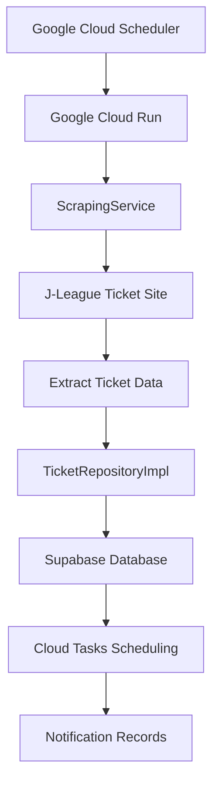
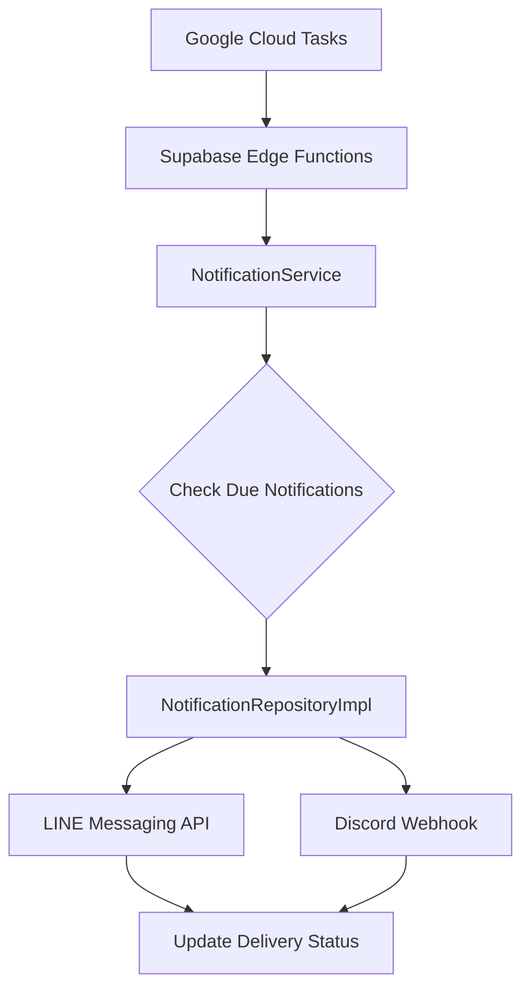

# System Architecture Document

## System Overview

The urawa-support-hub is an automated ticket monitoring and notification system for Urawa Red
Diamonds supporters. The system scrapes ticket information from the J-League website, stores it in a
database, and sends timely notifications to LINE groups before ticket sales begin.

## Technology Stack

| Layer                       | Technology              | Purpose                               | Execution Frequency |
| --------------------------- | ----------------------- | ------------------------------------- | ------------------- |
| **Scraping Execution**      | Google Cloud Run        | Playwright execution, data extraction | Once daily          |
| **Schedule Trigger**        | Google Cloud Scheduler  | Trigger daily scraping                | 12:00 JST daily     |
| **Notification Scheduling** | Google Cloud Tasks      | Individual notification timing        | As scheduled        |
| **Data Storage**            | Supabase PostgreSQL     | Ticket and notification history       | Real-time           |
| **Data API**                | Supabase PostgREST      | CRUD operations                       | On-demand           |
| **Notification Delivery**   | Supabase Edge Functions | LINE/Discord messaging                | When triggered      |

## Hybrid Architecture Implementation (GCP + Supabase)

### High-Level Architecture

```
┌─────────────────────────────────────────────────────────┐
│                Google Cloud Platform                    │
├─────────────────────────────────────────────────────────┤
│  Cloud Scheduler → Cloud Run → Cloud Tasks             │
│       ↓              ↓            ↓                     │
│   (12:00 JST)   (Scraping)   (Schedule)                │
└─────────────────────────────────────────────────────────┘
                         ↓
┌─────────────────────────────────────────────────────────┐
│                      Supabase                          │
├─────────────────────────────────────────────────────────┤
│  PostgreSQL ← PostgREST API → Edge Functions           │
│      ↓           ↓                ↓                     │
│   (Storage)   (CRUD API)    (Notifications)            │
└─────────────────────────────────────────────────────────┘
                                     ↓
┌─────────────────────────────────────────────────────────┐
│                  External Services                      │
├─────────────────────────────────────────────────────────┤
│            LINE API        Discord Webhook              │
└─────────────────────────────────────────────────────────┘
```

## Clean Architecture Implementation

### Layer Structure

```
┌─────────────────────────────────────┐
│     Interface Layer                │  ← Cloud Run Service, Edge Functions
├─────────────────────────────────────┤
│     Application Services           │  ← ScrapingService, NotificationService  
├─────────────────────────────────────┤
│        Domain Layer               │  ← Entities: Ticket, NotificationHistory
│                                   │    Interfaces: TicketRepository
├─────────────────────────────────────┤
│     Infrastructure Layer          │  ← RepositoryImpl, CloudTasks, Supabase
└─────────────────────────────────────┘
```

### Layer Responsibilities

#### 1. Interface Layer (Cloud Run + Edge Functions)

**Responsibility**: Handle external requests and trigger application workflows

**Components:**

- **Cloud Run Service**: Web scraping execution environment
  - `scrape`: Daily ticket extraction endpoint
  - `health`: Service health monitoring endpoint
- **Supabase Edge Functions**: Notification delivery and health monitoring
  - `send-notification`: Process individual notification requests
  - `system-health`: Monitor system status and performance

**Key Features:**

- HTTP endpoint handling
- Authentication and authorization
- Request/response transformation
- Error boundary implementation

#### 2. Application Layer (Services)

**Responsibility**: Orchestrate business operations and coordinate between layers

**Service Components:**

- **ScrapingService**: Web scraping orchestration and data extraction
- **NotificationService**: Multi-channel notification coordination
- **CloudTasksService**: Event-driven notification scheduling

**Key Features:**

- Business workflow orchestration
- Cross-cutting concerns (logging, monitoring)
- External service integration
- Transaction management

#### 3. Domain Layer (Core Business Logic)

**Responsibility**: Encapsulate business rules and domain knowledge

**Domain Components:**

- **Business Entities**: Ticket, NotificationHistory, NotificationConfig
- **Repository Interfaces**: TicketRepository, NotificationRepository
- **Domain Services**: Business rule validation and processing

**Key Principles:**

- **Technology Independence**: No external framework dependencies
- **Business Logic Encapsulation**: Rich domain entities with behavior
- **Interface Segregation**: Focused repository contracts
- **Configuration-Driven Design**: Externalized business rules

#### 4. Infrastructure Layer (Technical Implementation)

**Responsibility**: Provide technical capabilities and external system integration

**Infrastructure Components:**

- **Repository Implementations**: Data persistence layer
- **External Service Clients**: Cloud Tasks, Playwright integration
- **Technical Utilities**: Error handling, logging, configuration management

## System Components

### Google Cloud Platform Components

#### Cloud Run Service

- **Purpose**: Execute web scraping with adequate resources
- **Configuration**:
  - Memory: 2GB
  - CPU: 1 vCPU
  - Timeout: 300 seconds
  - Concurrency: 1 (sequential processing)

#### Cloud Scheduler

- **Purpose**: Reliable daily trigger mechanism
- **Configuration**:
  - Schedule: 0 3 * * * (03:00 UTC = 12:00 JST)
  - Target: Cloud Run service
  - Authentication: OIDC token

#### Cloud Tasks

- **Purpose**: Event-driven notification scheduling
- **Configuration**:
  - Queue: notifications
  - Location: asia-northeast1
  - Retry policy: 3 attempts with exponential backoff
  - Rate limiting: 10 dispatches/second

### Supabase Components

#### PostgreSQL Database

- **Purpose**: Primary data storage with ACID compliance
- **Features**:
  - Row Level Security (RLS)
  - Automatic triggers for notification scheduling
  - Real-time subscriptions capability

#### PostgREST API

- **Purpose**: Auto-generated REST API from database schema
- **Features**:
  - Type-safe database operations
  - Automatic API documentation
  - Built-in filtering and pagination

#### Edge Functions

- **Purpose**: Serverless notification delivery
- **Functions**:
  - `send-notification`: Process individual notification requests
  - `system-health`: Monitor system status and performance

## Data Flow Architecture

### Ticket Monitoring Flow



### Notification Delivery Flow



## Design Patterns

### Repository Pattern (Enhanced)

- Abstracts data access behind interfaces
- Enables testing with mock implementations
- Isolates domain logic from persistence concerns
- **Enhanced**: Integrates with Cloud Tasks for scheduling

```typescript
interface TicketRepository {
  save(ticket: Ticket): Promise<void>;
  findByMatchDate(date: Date): Promise<Ticket[]>;
  // Event-driven notification scheduling
  scheduleNotifications(ticketId: string): Promise<void>;
}
```

### Configuration-Driven Design

- Externalized notification timing configuration
- Runtime adjustable without code changes
- Type-safe configuration management
- Supports complex timing calculations

```typescript
export const NOTIFICATION_TIMING_CONFIG = {
  day_before: {
    displayName: 'Day before sale start',
    calculateScheduledTime: (saleStartDate: Date): Date => {
      const scheduledTime = new Date(saleStartDate);
      scheduledTime.setDate(scheduledTime.getDate() - 1);
      scheduledTime.setHours(20, 0, 0, 0);
      return scheduledTime;
    },
    toleranceMs: 5 * 60 * 1000,
  },
};
```

### Event-Driven Architecture

- **Decoupled Components**: Services communicate via events
- **Asynchronous Processing**: Non-blocking notification scheduling
- **Scalable Design**: Independent scaling of components
- **Error Isolation**: Failures in one component don't cascade

### Service Orchestration Pattern

```typescript
// Cloud Run orchestrates multiple services
export class ScrapingOrchestrator {
  constructor(
    private scrapingService: ScrapingService,
    private ticketRepository: TicketRepository,
    private cloudTasksService: CloudTasksService,
  ) {}

  async executeDaily(): Promise<void> {
    const tickets = await this.scrapingService.scrapeTickets();

    for (const ticket of tickets) {
      await this.ticketRepository.save(ticket);
      await this.cloudTasksService.scheduleNotifications(ticket);
    }
  }
}
```

## Error Handling Strategy

### Layered Error Handling

- **Domain Layer**: Business rule violations
- **Application Layer**: Service orchestration errors
- **Infrastructure Layer**: External service failures
- **Interface Layer**: HTTP/request errors

### Retry Mechanisms

- **Cloud Tasks**: Built-in exponential backoff
- **Database Operations**: Connection pool retry
- **External APIs**: Custom retry with circuit breaker

### Error Recovery

```typescript
export class ErrorRecoveryService {
  async handleScrapingFailure(error: Error): Promise<void> {
    // Log structured error
    await this.logger.error('Scraping failed', { error, timestamp: new Date() });

    // Send alert to Discord
    await this.alertService.sendErrorAlert(error);

    // Schedule retry if appropriate
    if (this.shouldRetry(error)) {
      await this.scheduleRetry();
    }
  }
}
```

## Security Architecture

### Service-to-Service Authentication

```typescript
const AUTH_FLOW = {
  'Cloud Scheduler → Cloud Run': 'OIDC Token (Service Account)',
  'Cloud Run → Supabase': 'Service Role Key (JWT)',
  'Cloud Tasks → Edge Functions': 'Service Role Key (Authorization Header)',
  'Edge Functions → External APIs': 'API Keys (Environment Variables)',
};
```

### Data Protection

- **Encryption in Transit**: TLS 1.3 for all API communications
- **Encryption at Rest**: Supabase automatic database encryption
- **Secrets Management**: Environment variables with proper access controls
- **Input Validation**: Type-safe processing at all boundaries

### Access Control

- **Principle of Least Privilege**: Minimal required permissions
- **IAM Policies**: Fine-grained Google Cloud IAM roles
- **Network Security**: Private service communication where possible

## Performance Characteristics

### System Performance Targets

| Metric                    | Performance Target | Implementation            |
| ------------------------- | ------------------ | ------------------------- |
| **Scraping Success Rate** | ~98%               | Cloud Run reliability     |
| **Notification Latency**  | <30 seconds        | Event-driven architecture |
| **Concurrent Processing** | Unlimited scaling  | Cloud Run auto-scaling    |
| **Error Recovery**        | 100% automated     | Cloud Tasks retry         |

### Resource Optimization

#### Cloud Run Optimization

- **Memory**: 2GB allocated for Playwright browser processes
- **CPU**: 1 vCPU for sufficient processing power
- **Cold Start**: Minimized with optimized container images
- **Scaling**: Automatic based on request volume

#### Database Optimization

- **Connection Pooling**: Supabase built-in pooling
- **Query Optimization**: Indexed columns for fast retrieval
- **Batch Operations**: Multiple notifications scheduled together

## Cost Analysis

### Google Cloud (Monthly)

- **Cloud Run**: ~60 minutes/month = Free (180,000 vCPU-seconds free tier)
- **Cloud Scheduler**: 1 job = Free (3 jobs free tier)
- **Cloud Tasks**: ~300 tasks/month = Free (1 million tasks free tier)

### Supabase (Monthly)

- **Database**: < 500MB = Free
- **Edge Functions**: ~300 invocations = Free
- **API Calls**: Minimal = Free

**Total Monthly Cost**: $0 (completely within free tiers)

## Monitoring & Observability

### Distributed Tracing

```typescript
interface TraceContext {
  traceId: string;
  spanId: string;
  parentSpanId?: string;
  operation: string;
  startTime: Date;
  endTime?: Date;
  tags: Record<string, any>;
}
```

### Structured Logging

```typescript
interface LogEntry {
  timestamp: string;
  severity: 'INFO' | 'WARN' | 'ERROR' | 'CRITICAL';
  service: 'cloud-run' | 'edge-functions' | 'cloud-tasks';
  operation: string;
  traceId?: string;
  duration_ms?: number;
  data?: Record<string, any>;
  error?: Error;
}
```

### Health Monitoring

#### Service Health Checks

- **Cloud Run**: `/health` endpoint with dependency checks
- **Edge Functions**: Built-in health monitoring
- **Database**: Connection and query performance monitoring
- **External Services**: API availability and response time tracking

#### Alert Thresholds

```typescript
const ALERT_THRESHOLDS = {
  SCRAPING_FAILURE_RATE: 0.1, // 10% failure rate
  NOTIFICATION_DELAY_MINUTES: 5, // 5 minutes delay
  ERROR_COUNT_PER_HOUR: 10, // 10 errors per hour
  RESPONSE_TIME_MS: 30000, // 30 second response time
};
```

## Scalability & Reliability

### Horizontal Scaling

- **Stateless Services**: Easy replication across regions
- **Load Distribution**: Multiple Cloud Run instances
- **Task Distribution**: Cloud Tasks queue management
- **Database Partitioning**: Time-based ticket archiving

### Disaster Recovery

#### Backup Strategy

- **Database Backups**: Daily automated snapshots (Supabase)
- **Configuration Backup**: Version-controlled settings
- **Code Backup**: Git repository with multiple remotes

#### Failover Mechanisms

- **Cloud Tasks**: Automatic retry with exponential backoff
- **Maximum 3 retry attempts**
- **Dead letter queue for persistent failures**
- **Automated error alerting via Discord webhooks**
